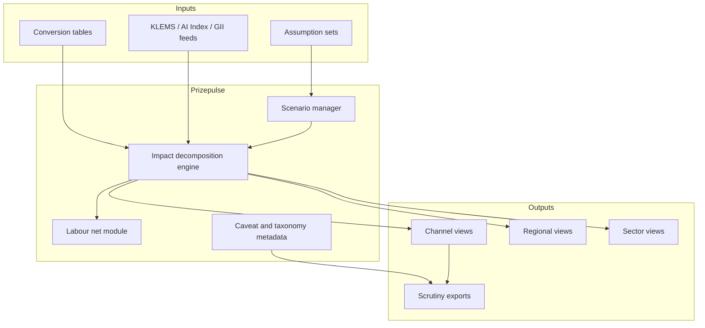

# Prizepulse

**Source:** `ai-in-gov/pwc-ai-uk-report-v2/`
**Domain:** `ai-gov`
**One-liner:** An economic-impact measurement system that decomposes AI’s contribution to GDP into productivity versus consumption-side channels — by sector, region and assumption set — so ministers and boards can invest against a live prize map rather than a one-off consultancy PDF.
**Wedge:** UK central departments (BEIS/HMT-class), devolved administrations and large sector regulators that must justify AI industrial strategy and regional growth deals using the PwC-style channels — labour productivity, product quality, personalisation/variety and time saved — updated as uptake assumptions change.
**Positioning:** Economic impact measurement for AI policy and capital allocation. Vendor ROI calculators stop at firm TCO; Prizepulse institutionalises the study’s insight that most UK GDP upside is *consumption-side product enhancement* (quality, variety, firm entry) not automation headlines — and makes that decomposition queryable, comparable and auditable over time.

## Market research synthesis

### Thesis from source

PwC’s June 2017 report “The economic impact of artificial intelligence on the UK economy” estimates UK GDP could be up to 10.3% higher in 2030 from AI — about £232 billion — among the largest commercial opportunities in the economy. The decomposition is the product idea: only 1.9 percentage points come from productivity gains, while 8.4 points come from consumption-side product enhancements and new firm entry stimulating demand. Within that, increased product quality contributes about 4.5%, personalisation and greater variety about 3.7%, with time-saved welfare large for households but small for GDP because the model predicts most extra time becomes leisure as real wages rise. Regional results are material for policy: England up to 10.6% (£204.5bn) and ~£2,295 extra household spending power; Wales ~9.8% (£7.9bn, £1,883); Scotland ~8.4% (£16.7bn, £2,209); Northern Ireland ~5.4% (£2.6bn, £1,934) — with trade-link differences explaining much of the GDP gap even when household spending power remains similar.

Methodologically the report combines: (1) econometric panel models on World/EU KLEMS for AI uptake’s marginal effect on labour productivity, including augmentation as well as replacement; (2) a machine-learning job-automation study (PwC UK Economic Outlook March 2017) predicting shares of jobs at high automation risk (probability ≥0.7) by industry task composition; (3) a US PwC AI Impact Index scoring nearly 300 use cases for product enhancements (personalisation, quality, time saved), with highest potential in health, automotive and financial services; (4) a Spatial Computable General Equilibrium (S-CGE) model capturing household–firm–government interactions across regions and sectors to net out secondary effects including new jobs in AI value chains and non-AI sectors from demand stimulus. Phasing matters: 2017–2024 is relatively productivity-weighted; later years are dominated by consumption-side impacts as firms enter and compete on ai-enhanced varieties. The UK’s potential is slightly above Northern Europe’s ~9.9%, attributed to stronger technology foundations and talent access (EMEA HQs). Jobs framing rejects pure displacement: no-human-in-loop roles go, but development, maintenance, operation, regulation and demand-driven non-AI jobs appear — “air traffic controllers” for autonomous vehicles as the evocative example.

Caveats are product requirements: results are potential size versus baseline steady-state growth, not a forecast of headline GDP; inequality, market failure, optimal policy and full welfare are out of scope but flagged; uptake follows an S-curve scaled by Global Innovation Index readiness; conversion tables map AI Index scores to variety, time-saved hours and marginal utility. Four AI elements are defined — automated, assisted, augmented, autonomous — with human-in-the-loop versus no-human-in-loop and hardwired versus adaptive axes. The market failure Prizepulse attacks is that this analysis arrives as a static PDF: when ministers change investment, skills or sector bets, nobody can re-pulse the prize by channel without commissioning another study from scratch.

### Buyer & economic model

- **Primary buyer:** chief economist or director of analysis in a UK economics/business department or devolved finance ministry; co-buyer is a major industry body’s research director for sector deals.
- **Users:** macroeconomic modellers (weekly), industrial strategy leads (per decision), regional growth officials (monthly), sector regulators (health, auto, financial services), corporate strategy teams benchmarking their sector’s share of the prize, NAO/scrutiny analysts (review cycles).
- **Budget owner / value metric:** analytical services and industrial strategy evaluation budgets. The value metric is decision cycle time to produce an updated channel/region/sector decomposition under a new assumption set, and the share of ai-related spending decisions that cite a current Prizepulse scenario ID. Secondary metric is reduction in policy debates that treat automation jobs risk as the sole AI economic story.
- **Competing status quo:** one-off consultancy CGE studies, slide extracts of the 10.3% headline, firm-level ROI tools that ignore consumption-side variety/firm-entry dynamics, and regional claims without comparable method.

### Domain constraints

- **Regulatory / trust / safety:** official statistics code and model transparency expectations; political sensitivity of regional rankings; labour-market communications must not weaponise automation probabilities without net job context.
- **Data sensitivity:** commercially sensitive sector uptake assumptions; household microdata used in extensions must stay in accredited environments; published outputs should be aggregates.
- **Change-management realities:** economists distrust black-box “AI GDP” products; Prizepulse must expose assumption sets, conversion tables and baseline definitions, and label results as potential impact versus forecast — matching the report’s own caveats.

## Business requirements

- BR-1: Every scenario must decompose GDP impact into at least productivity versus consumption-side channels, with consumption further split into quality, personalisation/variety and time-saved where modelled.
- BR-2: Users must be able to vary uptake S-curve, GII readiness scaling, automation probabilities and AI Index enhancement scores without silently changing baseline definitions.
- BR-3: Outputs must be available for UK regions (England, Scotland, Wales, Northern Ireland) and for industrial sectors, including indirect/induced effects language consistent with the S-CGE approach.
- BR-4: Results must be labelled as potential impact versus baseline, not as unconditional GDP forecasts, in every API response and export.
- BR-5: Job impacts must present displacement, creation and net narratives — including AI value-chain and demand-driven non-AI jobs — not automation risk alone.
- BR-6: Assumption sets must be versioned and comparable so two policy options differ only where intended.
- BR-7: Health, automotive and financial services must be first-class sector lenses given AI Index concentration of product-enhancement potential.
- BR-8: Household spending-power metrics must sit alongside GDP % so regional communications are not GDP-only.
- BR-9: Phase charts (productivity-led early years vs consumption-led later years) must be reproducible as of any scenario year 2017–2030.
- BR-10: Scrutiny exports must include caveat text covering exogenous shocks and baseline technological-change ambiguity called out in the appendix.
- BR-11: Assisted/augmented versus autonomous (no-human-in-loop) uptake mixes must be configurable inputs, reflecting the report’s four-element AI taxonomy.
- BR-12: The commercial outcome is reusable measurement infrastructure: ministries re-pulse the prize quarterly instead of re-procuring a static study annually.

## User stories

Canonical user stories live in sibling [USER_STORIES.md](USER_STORIES.md).

## System design

### Overview

Prizepulse stores canonical and user assumption sets, runs or retrieves S-CGE-class impact decompositions (initially seeded from the PwC methodology parameters), and serves channel/region/sector results with mandatory caveat metadata. It is an analytical product API plus operator console — not a training platform for ML models — focused on making the UK AI economic prize measurable, comparable and decision-linked over time.

### Actors & boundaries

- **Actors:** departmental economists, strategy officials, sector bodies, scrutiny bodies, platform stewards; eventually accredited researchers.
- **Trust boundary:** published aggregates vs restricted assumption workspaces; no household microdata in the default SaaS boundary; model code and conversion tables are auditable artifacts.
- **Human-in-the-loop points:** publishing a scenario to ministers; changing official conversion tables; endorsing a scenario as “department reference.”

### Core capabilities

1. **Scenario and assumption-set management**.
2. **Channel decomposition engine** (productivity vs consumption components).
3. **Regional impact views**.
4. **Sectoral impact views** with AI Index lenses.
5. **Labour displacement/creation nets**.
6. **Phase timeline projections (2017–2030)**.
7. **Household spending-power metrics**.
8. **Assumption diff and scrutiny export**.
9. **Caveat and taxonomy metadata** (four AI elements).
10. **Reference scenario governance**.

### Conceptual data

- **Primary entities:** Scenario, AssumptionSet, ConversionTable, ChannelImpact, RegionalImpact, SectorImpact, LabourEffect, PhasePoint, CaveatBundle, ReferenceEndorsement.
- **Critical events:** scenario created/cloned, assumptions changed, model run completed, reference endorsed, export generated, conversion table versioned.
- **Retention / audit needs:** assumption and result history retained for parliamentary and NAO review cycles; endorsed references immutable.

### Integrations (conceptual)

- **Systems of record:** departmental evidence libraries, ONS/official statistics feeds (aggregates), KLEMS-derived productivity inputs, industrial strategy trackers.
- **Upstream signals:** updated automation risk studies, AI Index refreshes, GII readiness scores, Budget policy assumption packs.
- **Downstream actions:** ministerial brief generators, regional deal appraisals, sector deal scorecards, public explainer pages.

### High-level architecture

### Success metrics

- **Leading:** scenarios run per quarter; share of outputs consumed with full channel split visible; median time to clone-and-delta a reference scenario; assumption-diff usage by scrutiny users.
- **Lagging:** share of AI industrial-strategy decisions citing a current scenario ID; reduction in automation-only public narratives from departmental communications; reuse rate of Prizepulse vs new one-off consultancy studies.

## OpenAPI skeleton

Canonical HTTP surface lives in sibling [openapi.yaml](openapi.yaml). Summary:

- **Base path:** `/v1/...`
- **Auth:** `X-API-Key` for departmental systems; Bearer JWT for analyst operators.
- **Resource groups:** Scenarios, AssumptionSets, ChannelImpacts, RegionalImpacts, SectorImpacts, LabourEffects, Reporting.
