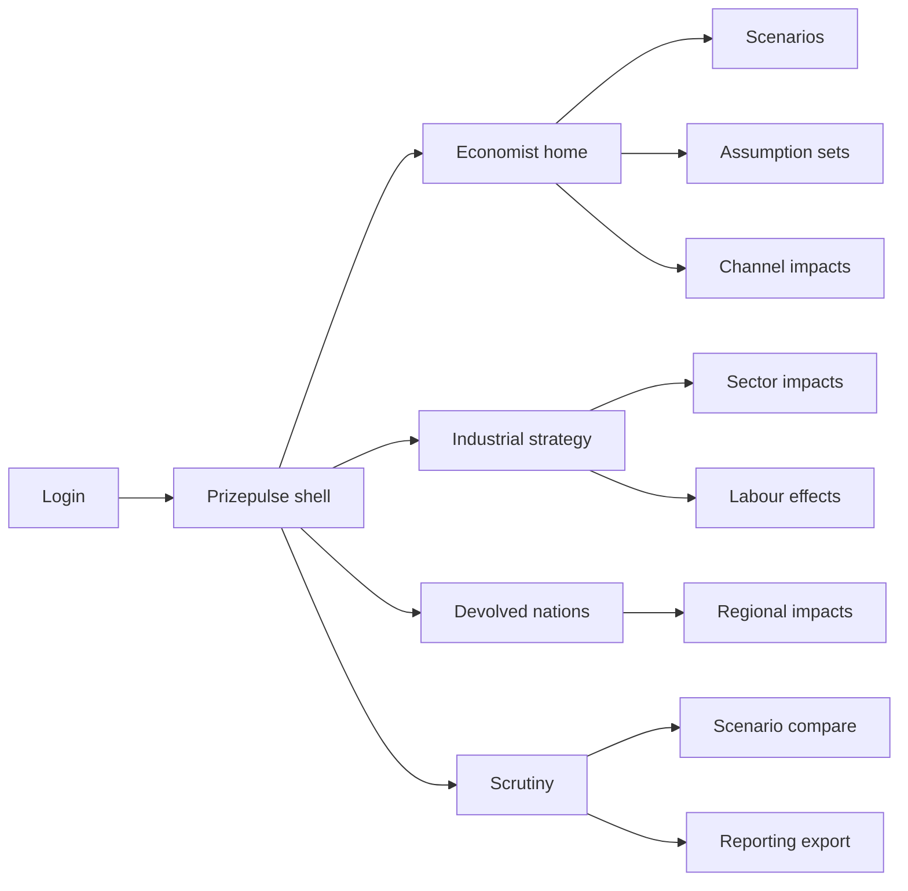
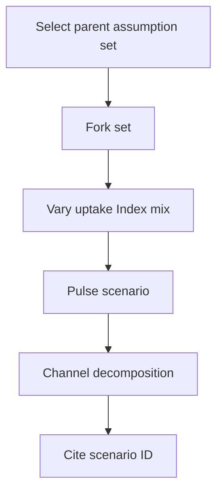
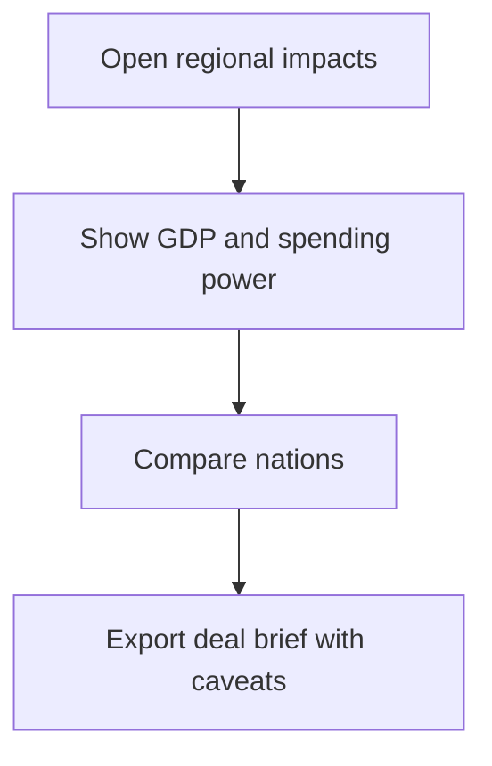

# Prizepulse — Web app

**Product:** [PRODUCT.md](./PRODUCT.md)
**Primary surface:** AI economic-impact measurement console (chief economist, industrial-strategy, and devolved-analyst workspaces under one Prizepulse shell)
**Secondary surfaces:** Ministerial briefing export (potential-impact labelled PDF); scrutiny pack with appendix caveats
**Design thesis:** Prizepulse is a live prize map — not a consultancy PDF and not a firm ROI calculator. The metaphor is a decomposable economy diagram: every scenario splits productivity from consumption-side channels (quality, personalisation/variety, time saved), by UK nation and sector, under a versioned assumption set. Visual language is Treasury teal and chart-ink on cool stone, with channel colours that never let the 1.9pp productivity slice visually dominate the 8.4pp consumption story. The Prizepulse wordmark sits as a quiet mint on every scenario and export so citations carry a scenario ID, not a headline alone.

## UX research synthesis

### Category peers (best-in-class)

- **OBR / HMT fiscal tools and scenario browsers:** Versioned assumptions, labelled projections vs forecasts. Steal: assumption diffing and caveat banners; reject black-box GDP oracles.
- **Oxford Economics / Cambridge Econometrics interactive scenario clients:** Sector-region CGE-style outputs for policy. Steal: regional + sector cuts with indirect effects language; reject static slide extracts as the product.
- **ONS interactive economic dashboards:** Nation/region comparability with methodology notes. Steal: household spending power beside GDP; reject automation scare charts as the home view.
- **McKinsey Global Institute interactive calculators (anti-pattern peer):** Polished headlines, weak channel audit. Steal: interaction speed; reject hiding consumption-side dominance behind automation narratives.

### Patterns to adopt / reject

- **Adopt:** Mandatory productivity vs consumption decomposition; versioned assumption sets with silent-baseline locks; UK four-nation + sector views; potential-impact labelling everywhere; jobs displacement/creation/net; health/auto/FS first-class lenses; phase charts 2017–2030; assisted/augmented/autonomous mix inputs; scrutiny caveat exports; scenario IDs on decisions.
- **Reject:** Single 10.3% hero without channels; automation-only jobs story; editable baseline without version fork; purple AI GDP glow; firm TCO as national prize proxy.

### Trust, density, and workflow constraints from PRODUCT.md

Economists distrust black boxes — expose conversion tables and baselines (BR-2, BR-6). Political sensitivity of regional rankings — pair GDP with household spending power (BR-8). Official-statistics-like transparency; results are potential vs baseline not forecasts (BR-4, BR-10). Labour communications must include net jobs (BR-5).

## Information architecture

### Nav model

### Roles → default home

| Role | Default home | Why |
|------|--------------|-----|
| Chief economist / modeller | Economist home — latest scenario channels | Decomposition is the product (BR-1) |
| Industrial strategy lead | Sector impacts — health/auto/FS | Enhancement concentration (BR-7) |
| Devolved finance analyst | Regional impacts + spending power | Nation gaps and trade links (BR-3, BR-8) |
| Sector regulator | Sector lens + labour effects | Net jobs narrative (BR-5) |
| NAO / scrutiny analyst | Scenario compare + caveat export | Auditable assumptions (BR-6, BR-10) |
| Corporate strategy (sector body) | Sector share of prize | Benchmark without firm TCO confusion |

### Cross-links to OpenAPI resources

| Nav area | OpenAPI tags / resources |
|----------|---------------------------|
| Scenarios | Scenarios |
| Assumption sets | AssumptionSets |
| Channel decomposition | ChannelImpacts |
| Nations / regions | RegionalImpacts |
| Industrial sectors | SectorImpacts |
| Jobs displacement/creation/net | LabourEffects |
| Briefings / scrutiny packs | Reporting |

## Screen inventory

### Economist home

- **Purpose:** Answer “under the current assumption set, how much of the prize is productivity vs consumption-side — and which scenario ID are we citing?”
- **Entry:** Modeller default.
- **Layout regions:** Brand + scenario ID; channel stacked bar (productivity vs quality vs variety vs time-saved); phase strip; assumption-set chip; potential-impact banner.
- **Primary actions:** Fork assumption set; open region/sector; export briefing.
- **Empty / loading / error:** Empty = load PwC-baseline assumption template with caveats.
- **BR / story ties:** BR-1, BR-4, BR-9, BR-12.

### Scenario library

- **Purpose:** Named scenarios with frozen outputs and citation IDs for spending decisions.
- **Entry:** Scenarios nav.
- **Layout regions:** Scenario table; owner; assumption-set link; last pulsed; cited-by count.
- **Primary actions:** Create; clone; archive; cite in decision log.
- **Empty / loading / error:** Validation requires channel decomposition present.
- **BR / story ties:** BR-6, BR-12.

### Assumption set editor

- **Purpose:** Vary S-curve, GII readiness, automation probabilities, AI Index scores, HITL mix — without silently changing baseline.
- **Entry:** From scenario; compare flow.
- **Layout regions:** Parameter panels; baseline lock indicators; conversion-table references; assisted/augmented/autonomous mix; diff vs parent set.
- **Primary actions:** Edit; fork; lock baseline; run pulse.
- **Empty / loading / error:** Attempt to edit locked baseline = force fork.
- **BR / story ties:** BR-2, BR-6, BR-11.

### Channel impact explorer

- **Purpose:** Mandatory decomposition UI; consumption split visible; productivity cannot dominate chrome.
- **Entry:** Home; scenario detail.
- **Layout regions:** Channel table and chart; pp and £; drill to drivers; potential-impact label.
- **Primary actions:** Toggle £/%; export channel table; annotate for ministers.
- **Empty / loading / error:** Missing consumption split = block publish.
- **BR / story ties:** BR-1.

### Regional impacts

- **Purpose:** England/Scotland/Wales/NI GDP % and £ plus household spending power.
- **Entry:** Devolved home.
- **Layout regions:** Nation cards (interactive); GDP vs spending-power dual metrics; trade-link notes; ranking with method caveat.
- **Primary actions:** Compare nations; export deal brief.
- **Empty / loading / error:** GDP-only view disabled by default toggle warning.
- **BR / story ties:** BR-3, BR-8.

### Sector impacts

- **Purpose:** Sector cuts with health, automotive, financial services promoted; indirect/induced language.
- **Entry:** Strategy home.
- **Layout regions:** Sector table; enhancement vs productivity mix; S-CGE secondary-effects notes; first-class sector pins.
- **Primary actions:** Filter; open labour; export sector deal.
- **Empty / loading / error:** Loading = model run progress.
- **BR / story ties:** BR-3, BR-7.

### Labour effects

- **Purpose:** Displacement, creation (AI value chain + demand-driven non-AI), net — not automation risk alone.
- **Entry:** From sector; scrutiny.
- **Layout regions:** Three-column narrative; high-risk task share optional secondary; “air traffic controller” style role examples field.
- **Primary actions:** Export jobs brief; suppress automation-only chart as default.
- **Empty / loading / error:** Automation-only export requires explicit override + caveat.
- **BR / story ties:** BR-5.

### Phase timeline

- **Purpose:** Reproduce early productivity-weighted vs later consumption-dominated years for any scenario year.
- **Entry:** Economist home; briefing.
- **Layout regions:** 2017–2030 scrubber; channel mix over time; annotation.
- **Primary actions:** Scrub year; snapshot for slide with scenario ID.
- **Empty / loading / error:** N/A.
- **BR / story ties:** BR-9.

### Scenario compare

- **Purpose:** Diff two policy options differing only where intended.
- **Entry:** Scrutiny; strategy.
- **Layout regions:** Side-by-side channels/regions; assumption diff highlighter; shared baseline confirmation.
- **Primary actions:** Select pair; export compare pack.
- **Empty / loading / error:** Incomparable baselines = block with fork guidance.
- **BR / story ties:** BR-6.

### Scrutiny and caveat export

- **Purpose:** Packs with potential-impact label and appendix caveats (exogenous shocks, baseline tech ambiguity).
- **Entry:** Scrutiny home.
- **Layout regions:** Caveat checklist; scenario ID; channel tables; labour net; export formats.
- **Primary actions:** Generate pack; attach to spending decision citation.
- **Empty / loading / error:** Missing caveat text blocks ministerial PDF.
- **BR / story ties:** BR-4, BR-10.

## Key flows

1. **Re-pulse the prize** — fork assumption set → edit uptake/Index/mix → run scenario → channel decomposition → cite scenario ID; failure: locked baseline edit blocked.

2. **Regional growth deal brief** — select nations → GDP + spending power → compare → export with caveats.

3. **Jobs narrative for communications** — sector → displacement/creation/net → export; override required for automation-only.

4. **Sector deal (health/auto/FS)** — pin sector → enhancement channels → labour → strategy export.

5. **Scrutiny compare** — two scenarios → assumption diff → shared baseline check → pack.

## Design system

### Tokens (CSS variables)

- `--color-ink: #1A2332` — text
- `--color-stone: #E8ECF0` — ground
- `--color-panel: #FFFFFF`
- `--color-treasury: #0B5C6B` — chrome / primary
- `--color-prod: #5B7C8A` — productivity channel (visually quieter)
- `--color-quality: #2A6F6A` — quality channel
- `--color-variety: #3D7AB5` — personalisation/variety
- `--color-time: #8A6D3B` — time-saved
- `--color-warn: #B45309` — forecast-misuse warning
- `--color-steel: #5C6B76`
- `--color-brand: #1A7A8C` — Prizepulse
- `--font-display: "Source Serif 4", serif` — £ and % figures
- `--font-body: "IBM Plex Sans", sans-serif`
- `--font-mono: "IBM Plex Mono", monospace` — scenario IDs, assumption versions
- `--space-1`…`--space-8`: 4px scale
- `--radius-sm: 4px`; `--radius-md: 6px`
- `--motion-pulse: 200ms ease-out` — scenario run complete
- `--motion-diff: 180ms ease-in-out` — assumption diff highlight
- `--motion-caveat: 160ms ease-out` — potential-impact banner
- Atmosphere: subtle grid like economic chart paper; no stock London skyline heroes; channel colours fixed in legend.

### Typography & brand

- Serif for impact numerals; mono for scenario IDs on every export.
- Brand on home, compare, and scrutiny packs.
- Login: brand hero; headline (“Most of the prize is consumption-side”); one CTA.

### Do / don’t

- **Do:** Always decompose channels; label potential impact; version assumptions; show net jobs; pair regional GDP with spending power.
- **Don’t:** Automation-only home; hide consumption share; unlabelled forecasts; purple AI; mix baselines silently.

### Accessibility & domain trust cues

- Channel colours with patterns/labels, not colour alone.
- Live regions announce pulse complete and caveat requirements.
- Focus: assumptions → channels → regions/sectors → export.
- Scenario ID always in focus order before share actions.

## Component patterns

- **ChannelStack** — productivity vs consumption splits with fixed colour semantics.
- **PotentialImpactBanner** — non-dismissible on results.
- **AssumptionSetDiff** — highlighted parameter deltas.
- **BaselineLock** — forces fork on edit.
- **NationDualMetric** — GDP %/£ + household spending power.
- **SectorPinRow** — health/auto/FS priority.
- **LabourNetTrio** — displacement / creation / net.
- **PhaseScrubber** — 2017–2030 channel mix.
- **ScenarioIdChip** — citation primitive.
- **CaveatPackExport** — appendix text included.

## Out of scope for v1 web

- Full S-CGE engine replacement for academic research; firm-level TCO/ROI product; household microdata browser; inequality welfare optimisation; live ONS data warehouse; citizen-facing GDP game.
